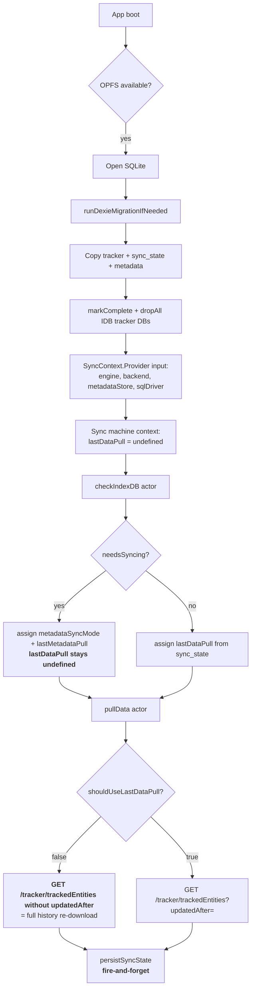
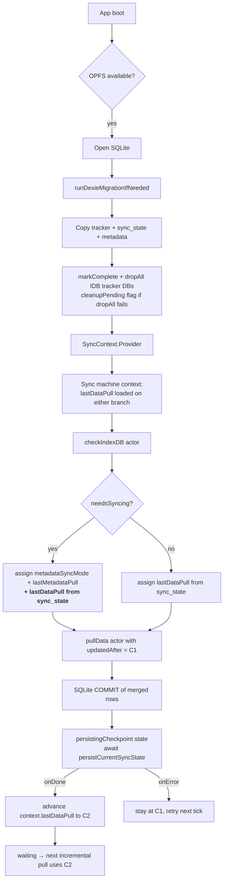

# IndexedDB → OPFS SQLite Migration & Pull Data Investigation

Investigation of two related but distinct production issues:

- **Problem A** — IndexedDB (Dexie) → OPFS SQLite migration correctness.
- **Problem B** — "Pull Data" not behaving as an incremental sync after migration, leading users to fall back to "Pull All Data".

This is a findings + recommendations document. No code has been changed.

Scope: `main` at commit `e8a0e09`.

---

## 1. Executive Summary

The storage backend abstraction and the Dexie ↔ SQLite migration are, on the whole, **structurally sound**. Recent commits (`133e315`, `e8a0e09`) hardened the boot ordering, honoured "sqlite" forcing, gated deletion on validated success, and prevented a fresh-install shortcut when only metadata (no tracker rows) is present.

The two remaining production symptoms have **different root causes**:

**Both** Pull Data and Pull All Data are intentionally **non-destructive**: they fetch from the server and merge into local storage. They differ only in whether they send `updatedAfter=<checkpoint>`. IndexedDB deletion is a separate, one-time migration cleanup step and must not be conflated with either pull. (See feedback: `feedback_pull_semantics.md`.)

| Symptom | Root cause | Data-loss risk |
|---|---|---|
| Users see a full re-download of history after upgrade / on every boot | The migrated `sync_state.lastPullAt` is not consulted on the boot path that fires when the server has newer metadata than the local store. `context.lastDataPull` stays `undefined`, `shouldUseLastDataPull` returns `false`, and the tracker request omits `updatedAfter`. | None (data is still merged), but heavy on bandwidth and DHIS2 API load, and slow on cellular. |
| A successful pull sometimes "forgets" its checkpoint | `persistSyncState` (sync.ts:227-238) is fire-and-forget. A rejected metadata-store write logs to console but the state machine has already advanced. Next boot re-reads the *old* `lastPullAt` and re-fetches the same window. | None locally, but silent regression to full pull. |
| Users click "Pull All Data" out of habit / distrust | Behavioural, not a code bug. Two buttons that both merge-fetch (differing only by `updatedAfter`) are hard for users to reason about, so they pick the one they trust more — currently the heavyweight one, which then hammers the DHIS2 server. | None, but load on server + user time. |

The `deleteAllData` actor at sync.ts:840 being empty is **correct behaviour** (Pull All Data must not destroy local rows). The `fullRefresh` state name and the empty actor are misleading scaffolding — they suggest a destructive path that intentionally isn't there. See §6 R3 for the recommendation to collapse the two buttons rather than fix the naming.

---

## 2. Architecture as Actually Implemented

### 2.1 Backend abstraction

Both backends are real, live, and switchable at runtime:

- Resolution: `src/db/backend.ts` — `resolveBackend()`, `hasOpfsCapability()`, `getBackendSetting()` / `setBackendSetting()`, `markSqliteUsed()` / `hasUsedSqlite()`.
- SQLite driver: `src/db/sqlite/wa-sqlite-driver.ts` (main thread) + `src/db/sqlite/wa-sqlite-worker.ts` (per-tab worker) + `src/db/sqlite/wa-sqlite-adapter.ts` (protocol bridge). Uses `wa-sqlite` with `OPFSCoopSyncVFS`, opened as `eregisters-metadata`.
- Dexie: `src/db/index.ts`, database name `MOHRegisterDB`, currently on schema v4+. Tracker collections wrap Dexie via `tanstack-dexie-db-collection` in `src/db/dexie/collections.ts`; the SQLite equivalents live in `src/db/sqlite/collections.ts`.

### 2.2 Dexie object stores (18 total, in `MOHRegisterDB`)

Metadata: `programRules`, `programRuleVariables`, `dataElements`, `programIndicators`, `trackedEntityAttributes`, `organisationUnits`, `optionSets` (composite key), `optionGroups` (composite key), `programs`, `dataSets`, `categoryOptionCombos`, `stageHierarchy`, `uiConfig`.

Sync / progress: `metadataVersions`, `metadataSyncProgress`, `syncState`, `indicatorEvaluations`.

Local drafts: `hmisDrafts`.

Tracker rows (tracked entities, enrollments, events, rule-results) live in **separate** Dexie databases created by TanStack Dexie collections: `MOHRegister_TrackedEntities`, `MOHRegister_Enrollments`, `MOHRegister_Events`, `MOHRegister_RuleResults`.

### 2.3 Boot orchestration (`src/App.tsx`)

1. `resolveBackend(setting, attemptSqliteInit)` — attempts OPFS init if allowed; caches probe failures with a version key.
2. **SQLite path**: open driver → `initCollections("sqlite", driver)` → `markSqliteUsed()` → `await runDexieMigrationIfNeeded(...)` → clear reverse-migration flag.
3. **Dexie path**: `initCollections("dexie")` → `await attemptReverseMigrationIfNeeded(setting)` → `markDexieLive()`.
4. Only after both promises settle does the app render `<SyncContext.Provider>`, so the sync machine cannot race migration.

Migration progress is surfaced via `<MigrationProgressBanner />`. Migration failure does not block boot but does not mark completion, so the next boot retries.

### 2.4 Migration flows

- **Forward** (`src/db/sqlite/migrate-from-dexie.ts`): idempotency check → data-existence check (tracker rows OR `metadataVersion` present) → copy tracker tables in 500-id chunks → copy `sync_state` and `metadata_versions` config rows → replace all migrated metadata tables in SQLite → verify counts → `markComplete()` → `source.dropAll()` (drops the 4 tracker Dexie DBs; `MOHRegisterDB` is intentionally preserved because HMIS drafts live there on both backends). `cleanUpPartialWrite()` on error; completion flag is not written on failure.
- **Reverse** (`src/db/dexie/migrate-from-sqlite.ts`): similar shape; **also copies `hmisDrafts`** (asymmetric with forward, which excludes them by design); on success calls `dropAllSqliteData(db)` to destructively drop the SQLite database.
- Non-negotiable invariants A, C, D, E, F from `docs/code-analysis.md` §6 are all upheld:
  - IDB tracker DBs are only dropped after `markComplete()` returns successfully.
  - Writes are batched inside `bulkInsertLocally()`.
  - Completion flag is checked; failure retries from scratch.
  - Metadata replace semantics are idempotent.
  - Cleanup is the last step of the successful path.

The one **structural gap** in migration: `markComplete()` and `dropAll()` are not co-transactional. If `markComplete()` succeeds but `dropAll()` throws mid-way (e.g. a worker crash after one of the four tracker DBs is deleted), the store enters a state where the flag says "done" but a stale IDB tracker DB may still exist. `isMigrationCurrent()` combined with `readDexieLastLiveAt()` mitigates this by re-triggering on the next Dexie boot; on the SQLite boot path there is no equivalent re-trigger. This is a low-probability edge case but is the closest thing to a data-loss vector in the migration path today.

---

## 3. Findings — Problem A: Migration

Every finding here has a clear code citation. Verdicts are relative to the invariants in `docs/code-analysis.md` §6 and §18.

### A1. Migration invariants A, B, C, D, E, F are upheld. ✅

- **A (IDB intact until validation)**: `migrate-from-dexie.ts` deletes only after `markComplete()` and count verification pass. Failures fall through to `cleanUpPartialWrite()`, leaving IDB untouched.
- **B (complete local copy)**: All Dexie stores relevant to metadata + all tracker DBs are enumerated; sync state and metadata versions are carried through as config rows.
- **C (atomic batch persistence)**: SQLite writes wrapped in `bulkInsertLocally()`.
- **D (restartable)**: Completion flag is only written on success; retries start over.
- **E (idempotent)**: `replaceMetadataTables()` upserts by primary key; sync state rows have fixed IDs (`"current"`, `"metadata-version"`).
- **F (cleanup last)**: `dropAll()` runs after `markComplete()`, not in a `finally`.

### A2. Sync-state migration IS wired at the storage layer. ✅

`migrate-from-dexie.ts` copies the `sync_state` config row (id `"current"`) containing `lastPullAt` / `lastPushAt` and the `metadata-version` config row containing `lastSync`. On the SQLite side these live in the config table and are readable via the metadata store.

**This is the important point**: the checkpoint is not lost during migration. Problem B is not caused by the migration dropping the checkpoint — it is caused by the sync machine's boot logic not reading it on one of its two branches (see §4).

### A3. Metadata-only data would previously have been skipped. ✅ FIXED in e8a0e09

Before `e8a0e09`, `existsAnyDexieData()` only checked tracker DBs. An installation that had pulled metadata but no tracker rows would trip the "fresh install" shortcut and skip migration, losing the metadata checkpoint. The current check is `existsAnyDexieData() || readMetadataVersion() !== undefined`. Correct.

### A4. Forced "sqlite" fallback silently degraded to Dexie. ✅ FIXED in 133e315

`resolveBackend()` now throws when the user forced "sqlite" and the OPFS init failed — the failure surfaces to the user instead of the app silently running on Dexie while thinking it's on SQLite.

### A5. Partial cleanup after `markComplete()`. ⚠️ Low residual risk

`markComplete()` and `dropAll()` are not co-transactional. If `dropAll()` throws after `markComplete()` succeeds, orphaned tracker Dexie DBs may remain. On the SQLite boot path, `isMigrationCurrent()` will report "done" and cleanup will not be retried. **Recommendation**: after `markComplete()`, keep a `cleanupPending: true` bit on the SQLite side and retry `source.dropAll()` on every subsequent SQLite boot until it succeeds; report success via telemetry.

### A6. HMIS drafts asymmetry. ⚠️ Documented / by design

Forward migration explicitly does not copy `hmisDrafts` because both backends store them in `MOHRegisterDB`. Reverse migration copies them because SQLite's `hmis_drafts` table is authoritative when SQLite has been live. This is correct but subtle. **Recommendation**: extract into a `MIGRATION_DIRECTION_RULES.md` note or inline the reasoning as a large comment in the migration modules.

### A7. Investigation report `docs/INDEXEDDB_TO_OPFS_SQLITE_MIGRATION_INVESTIGATION.md`. ✅ Delivered — this document.

---

## 4. Findings — Problem B: Pull Data / incremental sync

### B1. The migrated `lastPullAt` is not consulted on the "needs sync" boot path. ❗ ROOT CAUSE

`src/machines/sync.ts` at line 890 defines the initial context with:

```ts
lastDataPull: undefined,
lastDataPush: undefined,
lastMetadataPull: undefined,
metadataSyncMode: "full",
dataPullMode: "incremental",
```

These are hardcoded — `App.tsx` at line 210-226 does not pass any initial checkpoint values through `SyncContext.Provider.input`, and the machine's context factory (line 890-892) does not accept them.

The machine's `checkIndexDB` actor (line 1030 onward) is the only place where `lastDataPull` is loaded from the store, and it has two mutually exclusive branches:

- **Line 1035-1057** — `!event.output.needsSyncing`: reads `syncState?.lastPullAt` and assigns it to context. ✅
- **Line 1058-1078** — `event.output.needsSyncing`: assigns `metadataSyncMode` and `lastMetadataPull`, but **does not read `syncState`**. `lastDataPull` stays `undefined`. ❌

Line 1064-1069 chooses `metadataSyncMode = hasEmptyTables || wasDatabaseDeleted ? "full" : "incremental"` — but note this is the *metadata* mode, not the *data* mode. `dataPullMode` remains at its default `"incremental"`. That combination — `dataPullMode === "incremental"` with `lastDataPull === undefined` — trips the guard:

```ts
// src/machines/sync-metadata-mode.ts:19-24
export function shouldUseLastDataPull(mode, lastDataPull) {
    return mode === "incremental" && lastDataPull !== undefined;
}
```

`shouldUseLastDataPull` returns `false`, so the `pullData` actor (sync.ts:352-369) omits `updatedAfter` from the tracker request and fetches everything.

The `needsSyncing` branch is exactly what fires after a migration when the server has advanced any metadata resource (very likely, given the number of resources tracked). So the very case where a user has just spent minutes migrating their local baseline is the case where the machine then behaves as if it had never synced data.

**This is the primary Problem B root cause.** The migration copies the checkpoint. The boot logic then reads the checkpoint only on the branch that doesn't need to run metadata sync. On the branch that does, the checkpoint is ignored, which forces a full tracker download.

### B2. "Pull All Data" is a superset merge, not a rebuild. ✅ Intentional / but the button is UX baggage

`FULL_DATA_SYNC` transitions to a `fullRefresh` state (sync.ts:1429) which invokes the empty `deleteAllData` actor (sync.ts:840). This is **correct by design** — Pull Data and Pull All Data must both be non-destructive. The empty actor is dead scaffolding from an earlier design; it should be removed or collapsed, not given a body.

Functionally: `Pull Data` sends `updatedAfter=<C1>`; `Pull All Data` omits `updatedAfter`. Everything else is identical (same actor, same merge-utils, same collections). That means once B1 is fixed, `Pull All Data` is equivalent to "Pull Data with the checkpoint reset to undefined" — there is no separate code path that users lose by removing the button.

Consequence for the current user complaint: users clicking Pull All Data are not getting a better result than a working Pull Data would give them; they are getting the same merge with an unnecessarily wide server query. The right fix is not to make Pull All Data destructive — it is to make Pull Data reliable enough that Pull All Data can be retired (see R3).

### B3. `persistSyncState` is fire-and-forget; a rejected write silently drops the checkpoint advance. ❗ HIGH SEVERITY

sync.ts:227-238:

```ts
persistSyncState: ({ context }) => {
    void persistCurrentSyncState(context.metadataStore, {
        lastDataPull: context.lastDataPull,
        lastDataPush: context.lastDataPush,
    }).catch((error: unknown) => {
        console.error("Failed to persist sync state:", error);
    });
},
```

The in-code comment above this block admits the prior version was even worse (bare `void fn(...)` with no catch). But it is still not an awaited effect: XState transitions immediately to `waiting` at sync.ts:1483-1485 without knowing whether the write committed. If the wa-sqlite worker is momentarily unresponsive, or the OPFS write rejects, the context in memory has advanced but the durable store has not. On next reload the machine reads the old `lastPullAt` and re-fetches everything from that older window — a Pull Data that "looks" incremental but silently re-does work.

### B4. Timestamp semantics were server-timezone-broken until 775517a. ⚠️ FIXED for display; unverified for filter round-trip

`utils/server-time.ts` (added in `775517a`) reads `system/info.serverTimeZoneId` and parses naive server timestamps in that zone. This is applied to UI display via `fromServerTime`. It is **not clear** from the code that the value stored in `context.lastDataPull` and then round-tripped back to the server as `updatedAfter` is normalised to the correct zone: it is stored and echoed as a string. If the DHIS2 endpoint parses `updatedAfter` in server-local time regardless of what the client sends, this is fine; if it accepts an offset, the string round-trip could be off. **Recommendation**: verify with a controlled request comparing two checkpoints spanning a UTC-vs-Kampala date boundary (see §7 test A).

### B5. No per-program / per-org-unit checkpoint isolation. ⚠️ MEDIUM

`sync_state` has a single `"current"` row (`sync-metadata-actors.ts:40-58`). The `SyncContext.Provider` key is `${userInfo.id}${orgUnit.id}` (App.tsx:222), which resets the *machine* on org-unit change but leaves the single global `lastPullAt` in place. Result: switching org-unit or program uses the previous program's cursor. In the current single-program deployment (`ueBhWkWll5v`) this is benign, but a second program added later would immediately see incorrect incremental windows.

### B6. Deleted server records are fetched but not applied as deletes. ⚠️ MEDIUM

The tracker field selector includes `deleted`, and the local SQLite schema has a `deleted INTEGER NOT NULL DEFAULT 0` column. But `merge-utils.ts` merges field-by-field with local-wins and never flips `deleted` on the local row when the server reports it as such. If a server record is deleted between two pulls, it may not re-appear in the incremental window (deletion may not touch `lastUpdated` depending on the DHIS2 version). Users perceive this as "Pull Data doesn't sync deletes" and reach for Pull All Data — which also does not actually apply deletes (see B2).

### B7. No concurrency guard around Pull Data. ⚠️ LOW / MEDIUM

`START_DATA_SYNC` is accepted from `idle`, `waiting`, and `failure` (sync.ts:1407, 1498, 1535). Two rapid clicks or a background auto-trigger colliding with a manual click can spawn two parallel `pullData` actor invocations. Neither is cancelled by the other; both write to the same store. This is not currently causing user-visible corruption because writes are keyed, but it doubles bandwidth on a slow network.

### B8. No auto-escalation to full pull on incremental failure. ✅ Correct

`docs/code-analysis.md` §25.3 warned about the anti-pattern of `if incremental sync fails: pullAllData()`. That anti-pattern is **not** present in the code. Failure retries stay in `dataPullMode: "incremental"`. Good — but see B2: because "full" doesn't actually delete, we don't currently have a safe recovery path in the other direction either.

### B9. Data-existence check for reverse migration. ✅

`attemptReverseMigrationIfNeeded` correctly no-ops when SQLite has never held data, and correctly triggers when it has (using `hasAnySqliteDataToMigrate`).

---

## 5. Root-Cause Report (per §30 of `code-analysis.md`)

**Problem A** — Did all existing local data, metadata and sync state migrate correctly?

Yes, structurally. Data and metadata migrate; sync state is copied. The one remaining residual risk is the `markComplete → dropAll` non-atomicity (A5). Everything else in §6 of `code-analysis.md` is upheld.

**Problem B** — After migration, does Pull Data correctly request and apply only changes since the last successful checkpoint?

No. Two independent root causes:

1. **B1** — The machine's boot logic ignores the migrated `lastPullAt` on the `needsSyncing` branch. This is the "not pulling from beginning" behaviour described in the prototype: after a migration the machine's `context.lastDataPull` is `undefined`, so the tracker request omits `updatedAfter`.
2. **B3** — Checkpoint persistence is fire-and-forget; a rejected write silently drops the advance and forces the next pull to re-download the same window.

Neither of these has anything to do with IndexedDB deletion or Pull All Data. **B2** is not a defect — Pull All Data is intentionally non-destructive; its only real difference from Pull Data is that it omits `updatedAfter`. Once B1 and B3 are fixed, Pull Data is functionally sufficient and Pull All Data adds no capability that isn't already reachable by resetting the checkpoint. See R3 for the collapse recommendation.

Latent, not the current trigger:
- **B5** (single global sync-state row) — irrelevant until a second program is added.
- **B6** (deletes not applied on merge) — will cause "stale record" complaints separately from the current full-pull complaint.
- **B7** (no concurrency guard) — doubles bandwidth on rapid clicks; not corrupting data.

Files & functions responsible:

| Concern | File | Symbol |
|---|---|---|
| Boot `needsSyncing` branch that drops `lastDataPull` | `src/machines/sync.ts` | `checkIndexDB` invocation, line 1058-1078 |
| Fire-and-forget checkpoint persistence | `src/machines/sync.ts` | `persistSyncState`, line 227-238 |
| Empty `deleteAllData` actor | `src/machines/sync.ts` | line 840 |
| Missing context input plumbing | `src/App.tsx` + `src/machines/sync.ts` | `SyncContext.Provider` input at line 210-226; context factory at line 890-892 |
| Incremental filter guard | `src/machines/sync-metadata-mode.ts` | `shouldUseLastDataPull`, line 19-24 |
| Tracker request builder | `src/machines/sync.ts` | `pullData` actor, line 287-415 |
| Global checkpoint row | `src/machines/sync-metadata-actors.ts` | `persistCurrentSyncState`, line 40-58 |

---

## 6. Recommendations

Ordered by production impact.

### R1. Load `lastPullAt` in both `checkIndexDB` branches. (Fixes B1.)

The `needsSyncing` branch at sync.ts:1058-1078 should assign `lastDataPull` and `lastDataPush` from `event.output.syncState` in addition to `metadataSyncMode` and `lastMetadataPull`. There is no correctness reason to drop them: a metadata resync is independent of the data checkpoint. If the intent is to force a full data pull on metadata schema change, that should be explicit and rare (only when `wasDatabaseDeleted`), not incidental to any `needsSyncing` outcome.

Suggested rule: preserve `lastDataPull` unless `wasDatabaseDeleted` is true, in which case reset it to `undefined` deliberately.

### R2. Persist the checkpoint synchronously and gate the state transition on success. (Fixes B3.)

Replace the fire-and-forget action with an awaited transition:

- After a successful `pullData` `onDone`, transition into a `persistingCheckpoint` state whose invoked actor calls `persistCurrentSyncState` and returns a `void`.
- Only on `onDone` of that actor do we advance to `waiting`.
- On `onError` we do **not** advance `lastDataPull` in memory either — retry with the previous checkpoint on the next tick so we re-do at most one window of work.

This makes the ordering: `fetch → apply to SQLite → COMMIT → persist checkpoint → COMMIT → advance state`. That is the ordering §22.5 of `code-analysis.md` asks for.

### R3. Retire "Pull All Data" as a user-facing button; keep only "Pull Data". (Replaces the old R3.)

Once R1 + R2 are in place, `Pull Data` reliably requests only changes since the last successful checkpoint, and does the right thing on first ever boot (`lastDataPull === undefined` → server returns everything, which is the only case where a full pull is actually needed).

That makes `Pull All Data` structurally redundant:
- **First boot after install** — `lastDataPull` is undefined; `Pull Data` fetches everything anyway.
- **First boot after migration** — post-R1, `lastDataPull` is loaded from the migrated `sync_state.lastPullAt`; `Pull Data` fetches only the delta.
- **Steady state** — `Pull Data` fetches the delta; `Pull All Data` would fetch the same delta plus a lot of already-known rows.
- **Recovery** (rare) — user believes a record was missed. Reachable by an admin action that resets the checkpoint, not by a top-level button that end-users click routinely.

Concrete recommendation:
1. Remove `FULL_DATA_SYNC` event, `fullRefresh` state, and the empty `deleteAllData` actor as dead scaffolding.
2. Remove the "Pull All Data" button from `src/routes/__root.tsx` (and any equivalent UI).
3. Add a "Reset sync checkpoint" action under an Admin/Settings menu that:
   - clears `sync_state.lastPullAt` in the metadata store,
   - clears `context.lastDataPull` on the running machine (via a new event, e.g. `RESET_DATA_CHECKPOINT`),
   - shows a confirmation dialog explaining the next `Pull Data` will re-fetch history.
4. `Pull Data` becomes the only routine sync verb. Its behaviour is: "give me changes since the last checkpoint; if I have no checkpoint, give me everything."

Rationale — merging removes the entire class of "which button do I click" confusion that is driving today's server load, and it does so without ever needing a destructive local operation. It also matches the "Core rule" in §18 of `code-analysis.md`: incremental after migration; full only on explicit recovery.

### R4. Add a sync mutex. (Fixes B7.)

Add a boolean `dataPullInFlight` in context. `START_DATA_SYNC` transitions only from `idle` and `waiting`, and both are guarded on `!dataPullInFlight`. Clear the flag on both `onDone` and `onError` of the `pullData` actor.

### R5. Apply tombstones on merge. (Fixes B6.)

In `merge-utils.ts`, when the server row has `deleted === true`, flip the local row's `deleted` flag (or hard-delete, depending on product intent for aggregate reports and UI). This should be a one-liner in each of `mergeTrackedEntity`, `mergeEnrollment`, `mergeEvent`.

### R6. Verify `updatedAfter` timezone round-trip. (Verifies B4.)

Add an integration test that:
- Persists `lastDataPull = "2026-01-15T22:00:00.000"` (Kampala time near UTC boundary).
- Confirms the outgoing HTTP request query parameter matches the DHIS2 server's expected zone.
- Confirms the returned records are exactly the delta since that instant.

If the DHIS2 tracker endpoint accepts an ISO offset (`+03:00`), format the parameter with an explicit offset from `utils/server-time.ts`. If it does not, no change is needed but the test should assert the current interpretation.

### R7. Retry cleanup on subsequent SQLite boots. (Fixes A5.)

After a successful `markComplete()`, write a `cleanupPending: true` config row. On every SQLite boot after that, if `cleanupPending` is set, attempt `source.dropAll()` again and clear the flag on success. Cost is minimal; closes the last data-safety gap in migration.

### R8. Add sync observability. (§28 of code-analysis.md.)

Emit a structured log line at the end of every pull:

```
syncMode=INCREMENTAL|FULL
checkpointFrom=<ISO>
checkpointTo=<ISO>
recordsFetched=<n>
recordsWritten=<n>
recordsDeleted=<n>
durationMs=<n>
```

This makes accidental full pulls immediately visible in the browser console / any log collector, and makes future regressions in R1/R2 obvious in production.

### R9. Consider per-program checkpoints. (Fixes B5.)

Replace the single `"current"` sync-state row with one row per `(programId)` (org unit is arguably orthogonal — the tracker `updatedAfter` filter is not org-unit-scoped in the DHIS2 API). Not urgent for the current single-program deployment, but should be resolved before any second program is enabled.

---

## 7. Test Plan (covering §14 and §29 of `code-analysis.md`)

The order matches implementation priority.

- **Migration test 1** — Populated Dexie install, no SQLite. After boot: SQLite tracker tables contain all rows; `sync_state.lastPullAt` matches Dexie's; `MOHRegister_TrackedEntities/Enrollments/Events/RuleResults` databases are deleted; `MOHRegisterDB` still exists.
- **Migration test 2** — Large Dexie install (multiple 500-id chunks). First, middle, and last row IDs are all present in SQLite.
- **Migration test 3** — Kill the process after `markComplete()` but before `dropAll()`. Second boot detects `cleanupPending` (after R7) and completes deletion.
- **Migration test 4** — Force `bulkInsertLocally()` to throw halfway. Completion flag is not written; IDB is intact; retry succeeds.
- **Migration test 5** — Metadata-only Dexie (no tracker DBs). Migration runs because `readMetadataVersion() !== undefined`.
- **Pull Data test A** — Migrate, then boot with server metadata unchanged (`!needsSyncing`). `context.lastDataPull` is populated from `sync_state`. Tracker request includes `updatedAfter`.
- **Pull Data test B** — Migrate, then boot with server metadata newer (`needsSyncing`). After R1, `context.lastDataPull` is still populated. Tracker request still includes `updatedAfter`.
- **Pull Data test C** — Simulate a rejected `persistCurrentSyncState` call. After R2, `context.lastDataPull` does not advance; retry re-persists.
- **Pull Data test D** — 10,000 records synced, then 3 creates + 2 updates + 1 delete on server. Trigger Pull Data. Expect ≈6 rows on the wire.
- **Pull Data test E** — Same scenario, back-to-back Pull Data with no server changes. Expect 0 rows on the wire.
- **Reset test F** — After R3, invoke "Reset sync checkpoint" from Admin. Next Pull Data omits `updatedAfter` and re-fetches; local tracker rows are *not* truncated; merged rows survive.
- **Concurrency test G** — Fire two `START_DATA_SYNC` events within 100ms after R4. Only one pull actor runs.
- **Offline test H** — Kill network, then boot the app. See §7.1 for the full offline test matrix.

### 7.1 Full-offline test matrix

- **O1** — First-ever boot with no connectivity. Expect: `useDataQuery<MeData>` fails; app shows a clear "cannot log in offline" screen; no partial local state is written. Behaviour is correct only if the user has logged in at least once online.
- **O2** — Warm boot offline (previously logged in, migration already complete). Expect: cached `me` from service worker; app renders; SyncContext initialises; `checkIndexDB` loads `lastDataPull` from SQLite; any sync attempt fails fast via `navigator.onLine`; routes render local tracker data; offline banner visible.
- **O3** — Warm boot offline during a mid-migration state. Expect: migration continues (it's local-only, needs no network); no `pullData` actor is scheduled until migration completes; when it does complete, sync attempts fail cleanly.
- **O4** — Offline write flow. Create a tracked entity offline. Expect: row persists with `syncStatus: pending`; app does not attempt to push; UI reflects pending state.
- **O5** — Reconnect after offline writes. Expect: `dataSync` (push) region drains the pending queue in a single mutex-protected pass; no duplicates; `syncStatus` advances `pending → syncing → synced`.
- **O6** — Offline Pull Data click. Expect: actor returns quickly (`navigator.onLine === false` short-circuit in `network-reachability.ts:63`); `connectivityStatus` set to `offline`; `context.lastDataPull` NOT advanced; user-visible message.
- **O7** — Server unreachable but browser thinks it's online (captive portal / DNS hijack). Expect: actor times out on a bounded retry; connectivity marked `degraded`; checkpoint preserved.
- **O8** — Long offline period (metadata now stale on the server). Expect: reconnect and Pull Data succeed; `checkMetadataSyncStatus` detects `needsSyncing`; after R1 the data checkpoint is still preserved on that branch.

---

## 8. Diagrams

### 8.1 Current (RED) — post-migration first pull



### 8.2 Corrected (BLUE) — with R1 + R2 + R3



---

## 9. Full Offline Requirements & Recommendations

The app is an offline-first PWA. "Full offline" means every user-facing operation that does not intrinsically require the server must work with no connectivity, and every operation that does require it must fail gracefully without corrupting local state or the sync checkpoint.

### 9.1 What already works offline

Verified from source:

- **Migrations are local-only.** `runDexieMigrationIfNeeded` and `runSqliteMigrationIfNeeded` read from IDB / SQLite and write to the other; no network. `App.tsx:113-180`.
- **Connectivity fail-fast.** `src/machines/network-reachability.ts:63` short-circuits on `!navigator.onLine`, so pull actors return immediately when the browser knows it is offline instead of waiting for a fetch timeout.
- **Actor-derived connectivity state.** Every sync actor returns `connectivityStatus` in its output. `sync-tracker-actors.ts:125,338,619-620` set `offline` / `degraded` / `healthy` from the reachability probe. The reducer at `sync.ts:118-125` preserves the prior status if a given actor has no opinion — so a metadata pull that didn't run doesn't overwrite a data pull's finding.
- **UI reflects state.** `src/routes/tracked-entity.tsx:499-503` renders "offline" and "degraded" banners bound to `connectivityStatus`.
- **Local reads don't touch the server.** TanStack DB collections are backed by the local store (Dexie or SQLite); `useLiveSuspenseQuery` resolves entirely from IndexedDB / OPFS.
- **Local writes queue via `syncStatus: pending`.** Documented in CLAUDE.md; the form machines write `pending` rows to collections and the `dataSync` region drains them when online.
- **Service worker.** `scripts/patch-sw.js` post-processes `build/app/service-worker.js` so the app shell and DHIS2 platform's `me` payload are cached — a warm boot succeeds offline.

### 9.2 Offline-related gaps

Ordered by severity.

- **O-Gap-1** — `App.tsx:230` uses `useDataQuery<MeData>(ME_QUERY)` at the top level. If the DHIS2 service worker cache misses (e.g. app updated but `me` wasn't in the new SW's precache manifest), the whole app blocks on a failing query. No fallback to a locally cached `me`. **Severity: HIGH** — a partial cache miss makes the app unusable offline.

- **O-Gap-2** — Migration completion is awaited before `<SyncContext.Provider>` renders (`App.tsx:149,165`). This is correct for consistency (routes should not run against a half-migrated store), but it means an interrupted migration that keeps retrying will keep the app on the "Preparing local storage…" spinner forever, offline or online. `<MigrationProgressBanner />` is inside the spinner, but there is no "continue with legacy store" escape hatch. **Severity: MEDIUM** — for a user who is fine reading their existing IndexedDB data while migration retries, this is a lockout.

- **O-Gap-3** — Fire-and-forget checkpoint persistence (B3) is even worse offline because the metadata-store write path is more likely to be contended — but the underlying fix is the same as R2.

- **O-Gap-4** — No visible "last successful pull" timestamp in the UI (a design decision, not a bug, but worth listing). Users offline for days cannot tell how stale their data is; combined with distrust of Pull Data, this contributes to the Pull All Data habit.

- **O-Gap-5** — The `dataPullInterval` (sync.ts:869-873) fires every 1-3 hours regardless of connectivity. Offline, this means the pull actor is invoked, hits `navigator.onLine === false`, and returns quickly — cheap, but noisy in logs. Not a real problem.

- **O-Gap-6** — When offline and the user clicks Pull Data (soon to be the only sync button per R3), the click currently proceeds through the state machine, fails fast, and returns to `waiting`. The UI does not always show a toast or banner that says "Pull skipped — you are offline." **Severity: LOW / UX** — but combined with the merge in R3, this becomes more important because Pull Data is now the *only* verb; its failure modes must be legible.

### 9.3 Full-offline recommendations

These extend R1-R9 without contradicting them.

- **R10 — Cache `me` locally after first successful load.** Persist a copy of `MeData` in the metadata store on every successful `ME_QUERY`. On boot, if `useDataQuery` returns an error and a cached copy exists, hand the cached copy to `<FullApp userInfo={...}>` and mark the machine's connectivity as `offline`. This closes O-Gap-1.

- **R11 — Add a migration timeout / escape hatch.** If `runDexieMigrationIfNeeded` retries fail for more than N attempts within a session, expose a "Continue with legacy storage for now" affordance. The user keeps Dexie live; migration will re-attempt on next reload. This closes O-Gap-2.

- **R12 — Never advance a checkpoint on an offline/failed pull.** Already implicitly required by R2. Make it explicit: if the actor's output is `connectivityStatus !== "healthy"`, do not even enter `persistingCheckpoint`. Keep `context.lastDataPull` at its previous value.

- **R13 — Never remove local rows because a pull failed.** No code today does this, but codify the invariant in a doc comment on the `pullData` actor so it survives future refactors: *"A failed or offline pull is always a no-op on local rows. Only successful merges may write."*

- **R14 — Surface staleness in the UI.** Display `lastDataPull` and `lastPushAt` on a small offline/sync widget (e.g. next to the Pull Data button). Users can see "Last synced 2 hours ago" and stop reaching for Pull All Data on speculation. Cheap, high signal-to-noise, addresses O-Gap-4.

- **R15 — Announce offline click outcomes.** When Pull Data (post-R3, the only sync verb) fails because `!navigator.onLine`, emit an antd `message.info` "You are offline — will sync when reconnected" instead of silently returning to `waiting`. Ties to O-Gap-6.

- **R16 — Reconnect-driven push drain.** When `connectivityStatus` transitions from `offline` / `degraded` to `healthy`, immediately schedule a `dataSync` push pass (respecting R4's mutex) and a `Pull Data` pull, in that order. Currently the machine relies on the 30-60 minute `dataSyncInterval` and 1-3 hour `dataPullInterval`. On reconnect, a user should not have to wait an hour to see their queued writes go out. If this trigger already exists, verify it — I did not find one in the sync machine on this pass.

- **R17 — Bound the reachability retry.** `network-reachability.ts` short-circuits on `!navigator.onLine`, which is good, but the online-but-unreachable case (captive portal / DNS block / VPN drop) can hang a `fetch()`. Confirm every server call in the sync region has an `AbortController` with a bounded timeout so `degraded` is returned within a few seconds. Addresses O7 in the test plan.

### 9.4 Interaction with R3 (retire Pull All Data)

Removing Pull All Data does not weaken offline behaviour — quite the opposite. Today, a user who has been offline for a while and reconnects tends to click Pull All Data, which then does a full server download at the exact moment their cellular connection is at its most fragile. A single Pull Data with a valid preserved checkpoint (post-R1) transfers a small delta and either succeeds or fails cleanly — much friendlier on flaky mobile networks.

### 9.5 Non-goals for offline

Not recommending:

- **Truncating local rows on any offline path** — never appropriate.
- **Blocking user interaction while offline** — the whole point of the PWA is that offline is a normal state.
- **Automatic full-refresh on reconnect** — R3 explicitly retires this; reconnect triggers Pull Data, not Pull All Data.
- **Persisting `me` in localStorage** — use the metadata store, so a single OPFS backup covers everything.

---

## 10. Not Yet Investigated / Open Questions

- Whether the DHIS2 tracker endpoint at `eregisters.health.go.ug` uses `lastUpdated` monotonically for record deletion — this is needed to know whether R5 (tombstones on merge) is sufficient, or whether a separate deletion endpoint / `changeLog` is required.
- Whether `hmis_drafts` in SQLite can drift from `hmisDrafts` in Dexie if the user toggles backends multiple times before all drafts are submitted. The current design assumes drafts are always transiently present on the currently active backend, but under backend flapping this may not hold.
- Whether `metadataVersions` needs its own dedicated migration test (currently covered indirectly).

These do not block the recommendations above but should be answered before shipping R5 and finalising the test plan.
