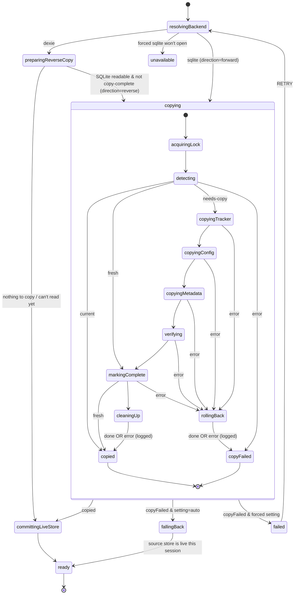

## Question

What is the exact state chart for the storage-boot machine that
replaces `App.tsx`'s `bootstrap()`?

Decide:

- **States**: how `code-analysis.md` §5's twelve states map onto real
  states, covering `resolveBackend`, forward (Dexie→SQLite), reverse
  (SQLite→Dexie), fresh install, already-migrated, and failed. Which are
  compound/shared between directions?
- **Durable flags as guards**: an inventory of every flag the current
  code reads/writes (`migration_status` row, `readDexieLastLiveAt`,
  `markSqliteUsed`/`hasUsedSqlite`, `clearSqliteMigrationFlag`,
  `markDexieLive`, cached OPFS failure) and which state reads/writes
  each. None move into machine context as the source of truth.
- **Step actors**: which existing helpers become `fromPromise` actors
  (copy tracker tables, copy sync_state + metadata_versions, replace
  metadata tables, verify, markComplete, dropAll/dropAllSqliteData,
  cleanUpPartialWrite) and their input/output types.
- **Context & output**: progress shape the banner needs; final output
  `{backend, metadataStore, sqlDriver}` handed to `SyncContext.Provider`.
- **Failure semantics**: which failures end in `failed` vs. proceed to
  `ready` on the old backend (today a failed copy still lets the app
  boot and retries next reload); the fatal "could not open local
  storage" path.
- **Hosting**: `createActor` in a hook vs. `createActorContext`; the
  React boundary that renders spinner/banner/error per state.

Output: a state diagram (Mermaid) + types, committed to the feature
branch, then the machine skeleton implemented with the existing
helpers wired in and the existing migration test suites still green.

## Resolution

Grilled 2026-09-26. Glossary terms **live store**, **previous store**,
**store copy** (forward / reverse) and **copy complete** added to
`CONTEXT.md`; the machine and logs use them.

### State chart

### Decisions

1. **Shape**: one shared `copying` compound state for both directions;
   the direction only picks the `StoreCopySteps` implementation.
2. **Step actors**: `src/db/store-copy.ts` defines `StoreCopySteps`
   (`detect`, `copyTracker`, `copyConfig`, `copyMetadata`, `verify`,
   `markComplete`, `cleanup`, `rollback`); `forwardCopySteps` /
   `reverseCopySteps` live in the existing migrate-from-* modules.
   `copyTracker` reports ids per table as it goes (`WRITTEN` events), so
   rollback covers tables written before a mid-copy failure.
3. **Failed copy** (Q2): `setting=auto` → `fallingBack`: the **source**
   store is live for this session only (forward → Dexie; reverse →
   SQLite on the copy's own driver); skips `committingLiveStore` so no
   `markDexieLive` / reverse copy corrupts the next attempt's baseline.
   Forced setting → `failed` with `RETRY`.
4. **Rollback failure** (Q6) is logged, never fatal → still `copyFailed`.
5. **Cleanup failure** (Q7) is logged → still `copied`. **Fixed an
   existing data-loss bug**: the old `run*IfNeeded` rolled back a
   verified copy when `dropAll()` / `dropAllSqliteData()` threw after
   `markComplete()`, leaving the flag set over deleted rows. The fix is
   in the shared `runStoreCopy` too, so the pre-cutover path is safe.
6. **Per-boot bookkeeping** (Q4): `markSqliteUsed` +
   `clearSqliteMigrationFlag` / `markDexieLive` run in
   `committingLiveStore`, best-effort, only on the path to `ready`.
7. **Reverse copy driver** (Q5): opened in `preparingReverseCopy`,
   closed when copying ends (or promoted to live on reverse fallback).
   Added optional `SqlDriver.close()`; wa-sqlite terminates its Worker.
8. **Cross-tab** (Q11): `copying` holds a `navigator.locks` Web Lock
   (`eregisters-store-copy`); `detecting` runs after the lock so a
   waiting tab sees "current". No Web Locks → runs unlocked.
9. **Hosting** (Q10): module-level singleton `getStorageBootActor()`
   (`src/machines/storage-boot-actor.ts`); components only `useSelector`
   it. Failures are states (`failed`, `unavailable`), never actor errors.
   Hand-off is the machine `output` `{backend, metadataStore, sqlDriver}`.
10. **Scope** (Q9): machine + tests only; `App.tsx` still calls the
    `run*IfNeeded` wrappers (now thin `runStoreCopy` calls) until the
    cutover ticket.

### Implemented (branch `feature/storage-migration-machine`, uncommitted)

- `src/db/store-copy.ts` — step contract, `copyTable`, `runStoreCopy`.
- `src/db/sqlite/migrate-from-dexie.ts`, `src/db/dexie/migrate-from-sqlite.ts`
  — refactored into `forwardCopySteps` / `reverseCopySteps`.
- `src/db/sqlite/driver-types.ts`, `wa-sqlite-driver.ts` — `close()`.
- `src/machines/storage-boot.ts` — the machine (deps injected via input).
- `src/machines/storage-boot-actor.ts` — real deps, Web Lock, singleton.
- Tests: `src/machines/__tests__/storage-boot.test.ts` (12),
  `src/db/__tests__/store-copy.test.ts` (2). Full suite: 58 files /
  392 tests pass; existing migrate-from-* suites unchanged and green.
